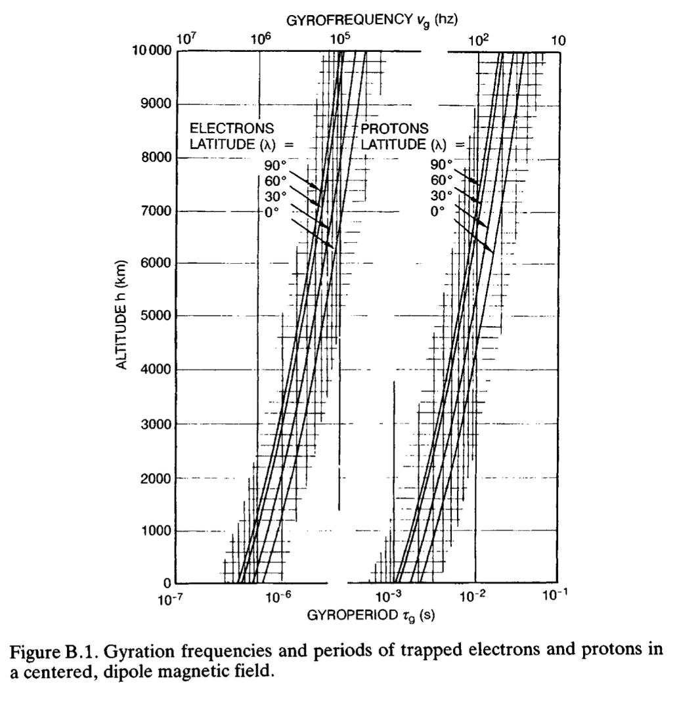

# Overview

This program simulates a particle's non-relativistic motion in earth's magnetic field, modeled as a simple dipole. Can easily be modified for any dipole. There are three different options for numerical integration: Euler Cromer is faster, but less accurate than both Boris and Runga Kutta 4th order (rk45). 
rk45 takes longer for similar accuracy, except when adaptive time step is especially useful such as at high latitudes.The Boris method can be computed to an arbitrary time step, usually shorter for similar accuracy. Inaccurate near low pitch angles <5deg (more than Runga Kutta) due to no adaptive steps. 

For equatorial bound particles in Boris method, the time step need is quite low at 1e-1 in nd time steps otherwise lower timesteps are generally needed. The Boris method also has a only simulates 1 drift period to shorten computation time. 

Boris method is tailored specifically to Lorentz force motion, as it conserves system's energy better. Boris method in general can handle E fields, but this functionality is currently omitted.

Initial condition and properties are measured in a more convenient centered dipole coordinate system while the integration is performed in non-dimensional cartesian coordinates.

# Use
```
git clone ...
cd ...
python3 command
```

To to modify run, edit top of `ParticleDemo.py`.


# Demo Example
Function demo generates various verification plots of to verify accuracy and compare algorithims. This generates various plots with different parameters for protons and elections, specifically L-shell, and kinetic energy. The results of these simulations can be found in [this folder](plots) 
The function trajectory_generator generates ~800 various trajectories for import into paraview, since one the fly generation is too computationally expensive

With _2dplots = True, generates 3 plots: error vs time, cartesian coordinates vs time, and x vs y
more plots can be enabled by uncommenting them in plots&#46;py. For checking accuracy or long simualtions, the energy.svg are crucial to checking to make sure the simulation maintains the desired level of accuracy.

Exports particle path trajectories as .VTKs for import into Paraview for viewing.
# Comparison of algorithims


## Appendix

A sample plot of a proton Gyrofrequency, and the corresponding verification plot



